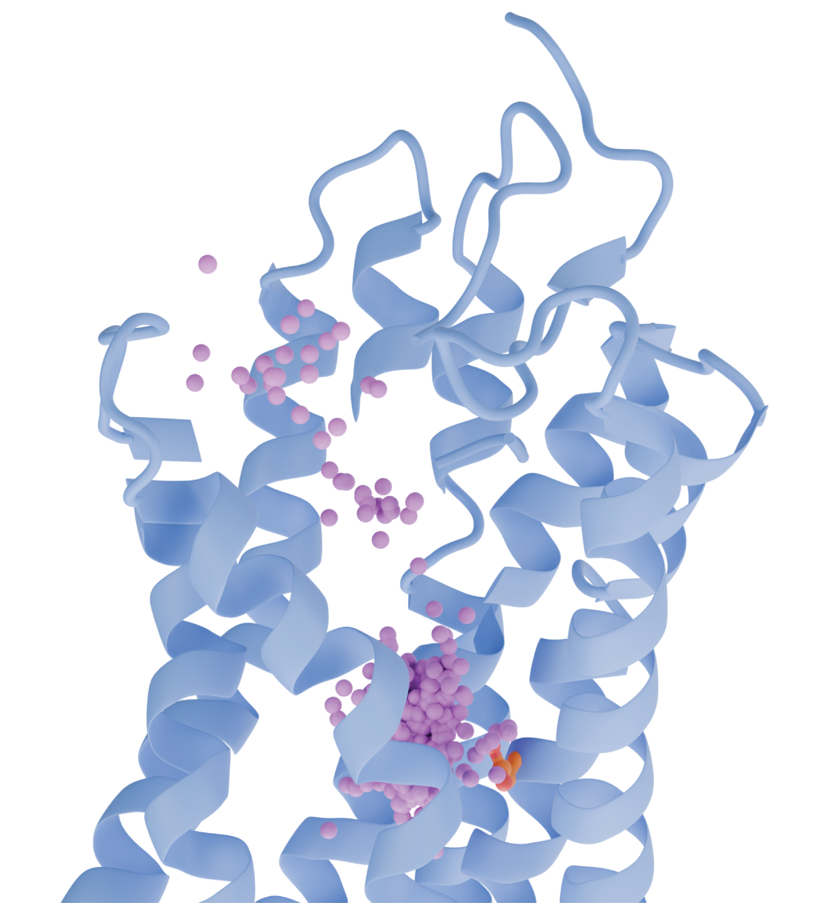

# OR_sodium

<p align="center">
  
</p>

This repository contains data, analysis scripts, and additional materials associated with the work:

**Sodium is an allosteric modulator of odorant receptors**  
Haag F<sup>†</sup>, Nicoli A<sup>†</sup>, Bößl F, Hopf R, Hernandez A, Hoffmann S, Richter P, Bauer J, Krautwurst P, Hummel T, Di Pizio A<sup>\*</sup>, Krautwurst D<sup>\*</sup>.  

<sup>†</sup> Equal contribution <br>
<sup>*</sup> Corresponding authors


## Repository Structure

```
OR_sodium/
├── data/
│   ├── BW_numbering/          # Ballesteros-Weinstein numbering for each OR
│   ├── initial_model/         # Prepared initial OR models
│   └── contact_analysis/      # PDB files with sodium contact frequencies in the B-factor
├── utilities/
│   ├── MD_protocol/           # OpenMM equilibration and production scripts
│   │   ├── README.md          # Protocol documentation and usage instructions
│   │   ├── equilibration.py   
│   │   ├── production.py      
│   │   └── boxsize.csv        # Example periodic box dimensions input (x,y,z in Å)
│   └── scripts/               # Analysis scripts and Jupyter notebooks
```

📊 **Interactive 3D viewer:** [Contact Analysis](https://anicoli.github.io/OR_sodium/data/contact_analysis/viewer.html)

This repository includes data for seven olfactory receptors:

| Receptor | UniProt Code | Class |  Full name  |
|----------|--------------|-------|-------------|
| OR51E1 | Q8TCB6 | I | Olfactory receptor 51E1 |
| OR51E2 | Q9H255 | I | Olfactory receptor 51E2 |
| OR1A1 | Q9P1Q5 | II | Olfactory receptor 1A1 |
| OR2W1 | Q9Y3N9 | II | Olfactory receptor 2W1 |
| OR5K1 | Q8NGC1 | II | Olfactory receptor 5K1 |
| OR8D1 | Q8WZ84 | II | Olfactory receptor 8D1 |
| OR11A1 | Q9GZK7 | II | Olfactory receptor 11A1 |

## Molecular Dynamics (MD) simulations

The MD trajectories and input files are deposited at Zenodo:

[](https://zenodo.org/records/18886666)
